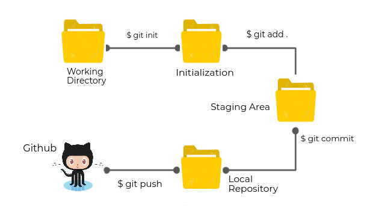
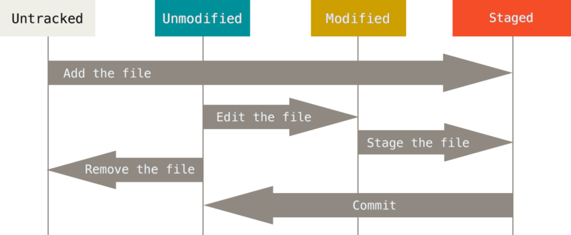
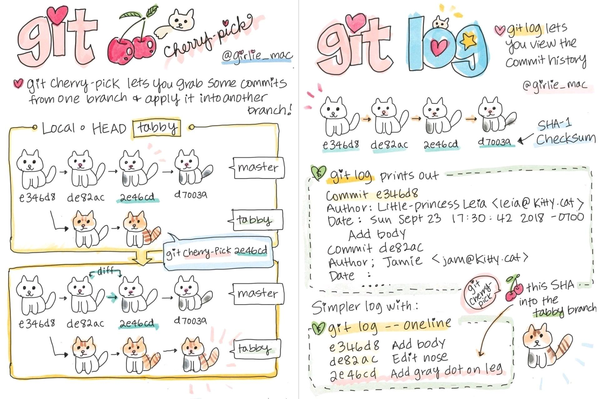
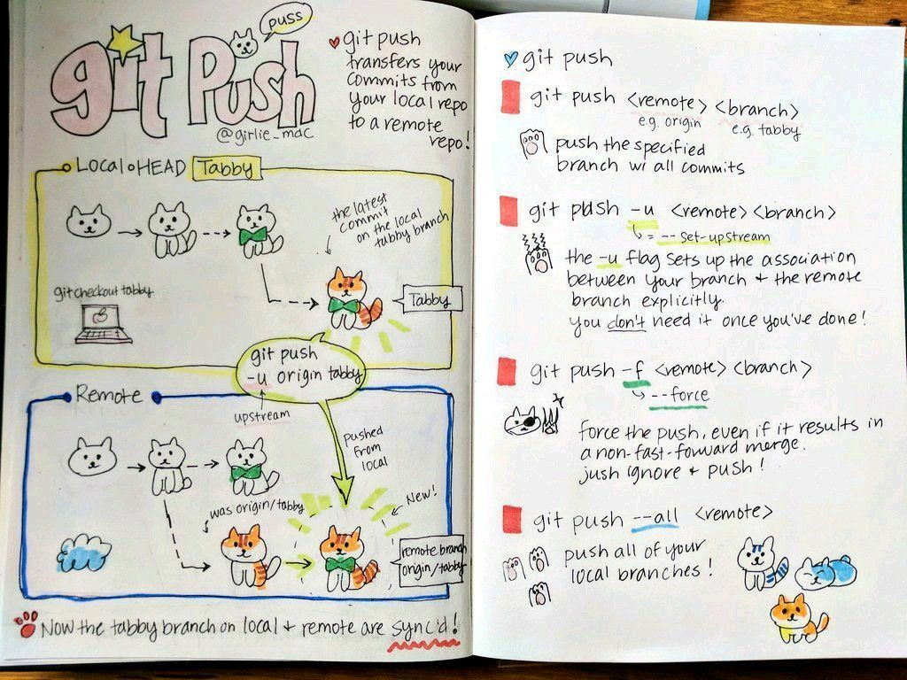

# Git and Github

## Introduction

Git is the most commonly used version control system. Git tracks all the changes you make to your files so that you have record of all the changes that has been done. By Reading this readme.md file you can understand how to use Git.

## Version Control System

- Version control is a management software responsible for managing changes to computer programs, documents, large websites, or other collections of information.
- Easy recovery of files/folders.
- Rollback to the previous versions.
- Informs us about Who, What, When, Why changes have been made.

## How Git Works

It start with the Initialization. We need to initialize our working directory as Git Directory with the command ```git init```. Once we have initialized the git repository we can add our files to staging area. Staging is nothing but tracking files from the working directory. We can add untracked files to staging area with the command ```git add <filename>``` or ```git add .``` to add all the files from that particular directory. We cant commit untracked files from the working directory until and unless we dont stage them. The commit is used to save your changes to local repository. Every time you save that file, all the changes made are tracked. Git commit command takes the snapshot recording the staged changes. We can commit a file by the following command ```git commit -m "<message>"```, ```message``` should be related to the changes made in that particular file at the time of staging. Once all the files are staged and commited, then we can push the local repository to the code hosting platform like Github for collaborations and to avoid losing all our program files due to any kind of failure of our local machine.

## Installing Git

- For Windows:
Download Git for Windows from [Git for Windows](https://gitforwindows.org/).
    ```https://git-scm.com/downloads```

- For Linux:
    - Debain/Ubuntu:
        ```sudo apt-get install git```
    - Redhat/CentOS:
        ```sudo yum install git```
    
- MacOS:
    ```brew install git```

## Git Setup

Setup git with the ```git config``` command.
First we will add username by the following command.
```git config --global user.name "Your Name"```

Then we will add email by the following command.
```git config --global user.email "Your Email"```


## Git Commands

1.```git init```
    Initializes a git repository in the current directory.
    This will create a hidden .git folder.
    That's where git stores everything.

2.```git status```
    Shows the status of the current repository.

3.```git add <filename>```
    Adds specific file to the staging area.

```git add .```
    Adds all the file to the staging area.



4.```git commit -m "<message>"```
    Commits the staged changes to the local repository.
    ```message``` is the message that will be displayed in the commit.

5.```git log```
    Shows the commit history of the current repository.

6.```git push```
    Pushes the local repository to the remote repository.

7.```git pull```
    Pulls the changes from the remote repository.

8.```git clone <url>```
    Clones the repository from the remote repository.

9.```git remote add <name> <url>```
    Adds a remote repository to the local repository.

10.```git remote -v```
    Shows the remote repositories of the local repository.

11.```git branch <name>```
    Creates a new branch.

12.```git branch```
    Shows the branches of the local repository.

13.```git checkout <name>```
    Checks out the branch.

14.```git merge <name>```
    Merges the branch.

15.```git branch -d <name>```
    Deletes the branch.

16.```git branch -D <name>```
    Deletes the branch permanently.

17.```git branch -m <oldname> <newname>```
    Renames the branch.

18.```git branch -r```
    Shows the remote branches of the local repository.

19.```git branch -a```
    Shows the local and remote branches of the local repository.

20.```git remote rm <name>```
    Deletes the remote repository.

## Git Visualization





# For more information on Git Commands, visit :
- [Git Cheat Sheet](https://git-scm.com/book/en/v2/Getting-Started-Installing-Git)
- [Git Cheat Sheet Education](static/git-cheat-sheet-education.pdf)
- [Git Kraken Git Bascis](static/git-kraken-git-bascis.pdf)

